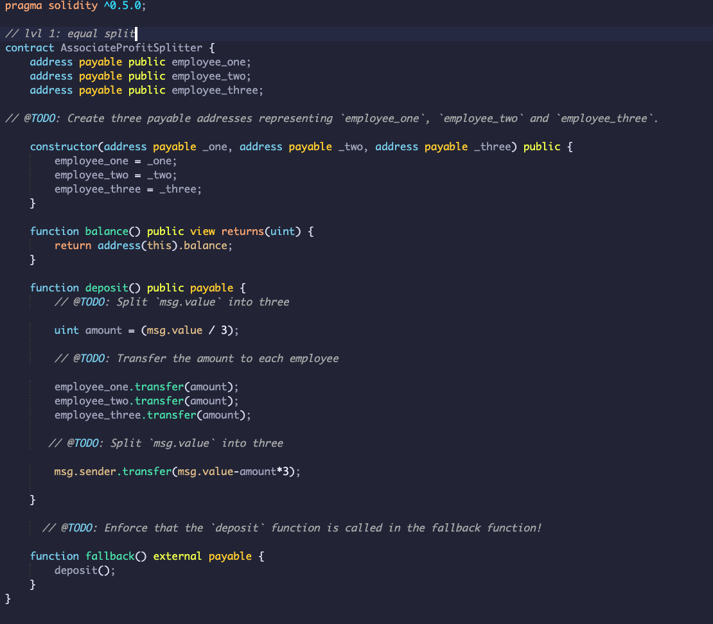
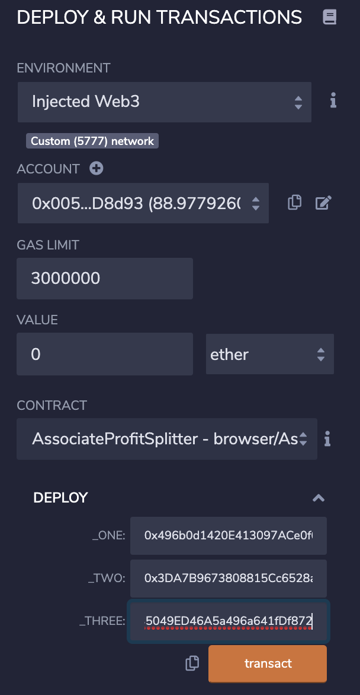
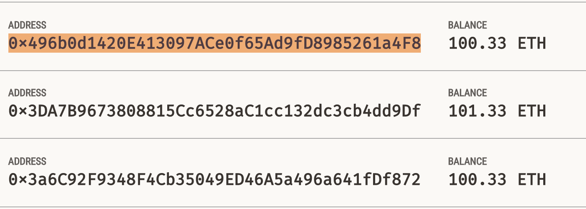
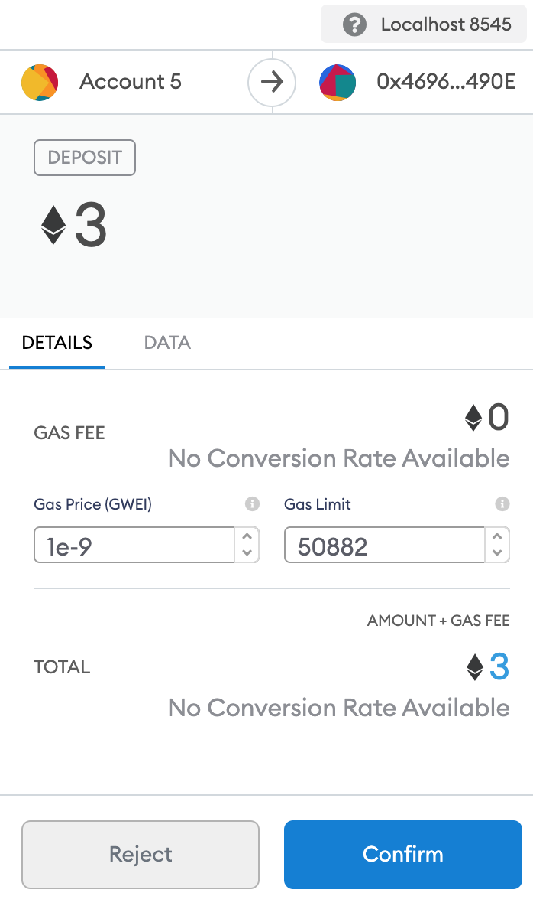
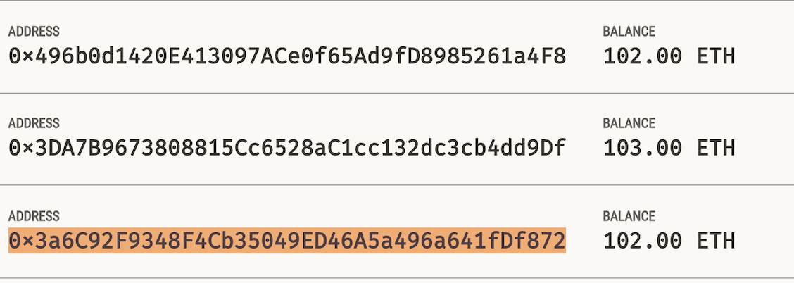
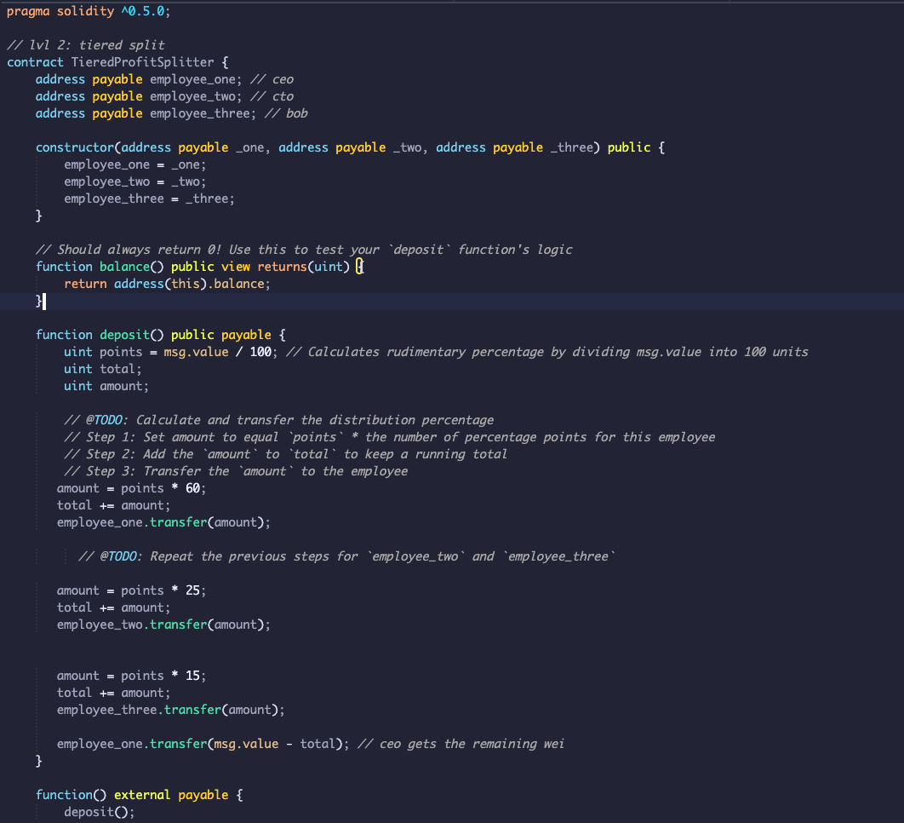
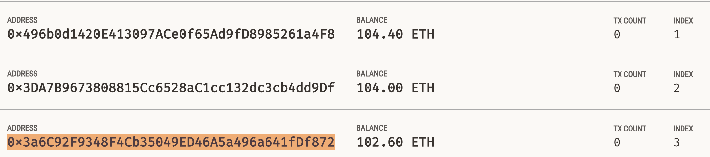
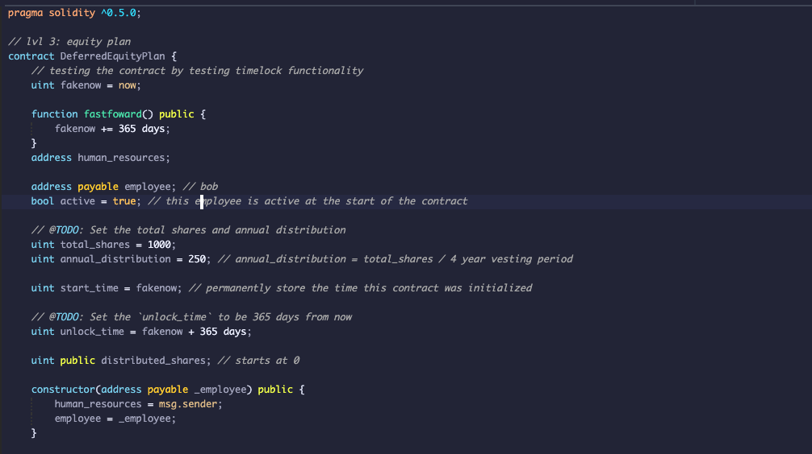
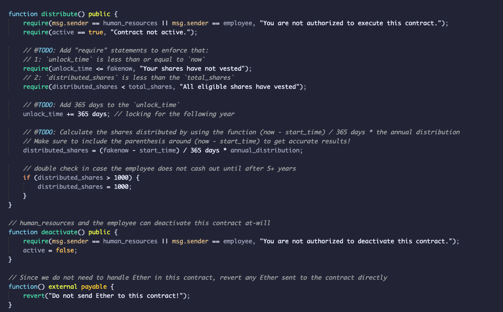
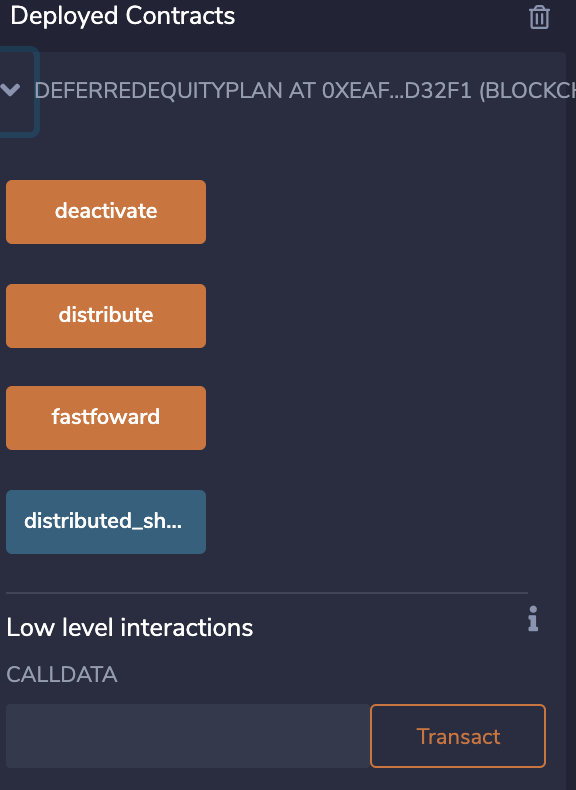

# Smart Contracts by Using Solidity

## Background

 What you will be doing is creating 3 `ProfitSplitter` contracts. These contracts will do several things:

* Pay your Associate-level employees quickly and easily.

* Distribute profits to different tiers of employees.

* Distribute company shares for employees in a "deferred equity incentive plan" automatically.


## Instructions

* **Level One** is an `AssociateProfitSplitter` contract. This will accept Ether into the contract and divide the Ether evenly among the associate level employees. This will allow the Human Resources department to pay employees quickly and efficiently.

* **Level Two** is a `TieredProfitSplitter` that will distribute different percentages of incoming Ether to employees at different tiers/levels. For example, the CEO gets paid 60%, CTO 25%, and Bob gets 15%.

* **Level Three** is a `DeferredEquityPlan` that models traditional company stock plans. This contract will automatically manage 1000 shares with an annual distribution of 250 over 4 years for a single employee.

### Level One: The `AssociateProfitSplitter` Contract

At the top of your contract, you will need to define the following `public` variables:

* `employee_one` -- The `address` of the first employee. Make sure to set this to `payable`.

* `employee_two` -- Another `address payable` that represents the second employee.

* `employee_three` -- The third `address payable` that represents the third employee.

Create a constructor function that accepts:

* `address payable _one`

* `address payable _two`

* `address payable _three`

Within the constructor, set the employee addresses to equal the parameter values. This will allow you to avoid hardcoding the employee addresses.

Next, create the following functions:

* `balance` -- This function should be set to `public view returns(uint)`, and must return the contract's current balance. Since we should always be sending Ether to the beneficiaries, this function should always return `0`. If it does not, the `deposit` function is not handling the remainders properly and should be fixed. This will serve as a test function of sorts.

* `deposit` -- This function should set to `public payable` check, ensuring that only the owner can call the function.

  * In this function, perform the following steps:

    * Set a `uint amount` to equal `msg.value / 3;` in order to calculate the split value of the Ether.

    * Transfer the `amount` to `employee_one`.

    * Repeat the steps for `employee_two` and `employee_three`.

    * Since `uint` only contains positive whole numbers, and Solidity does not fully support float/decimals, we must deal with a potential remainder at the end of this function since `amount` will discard the remainder during division.

    * We may either have `1` or `2` wei leftover, so transfer the `msg.value - amount * 3` back to `msg.sender`. This will re-multiply the `amount` by 3, then subtract it from the `msg.value` to account for any leftover wei, and send it back to Human Resources.

* Create a fallback function using `function() external payable`, and call the `deposit` function from within it. This will ensure that the logic in `deposit` executes if Ether is sent directly to the contract. This is important to prevent Ether from being locked in the contract since we don't have a `withdraw` function in this use-case.

#### Test the contract

In the `Deploy` tab in Remix, deploy the contract to your local Ganache chain by connecting to `Injected Web3` and ensuring MetaMask is pointed to `localhost:8545`.


You will need to fill in the constructor parameters with your designated `employee` addresses.


Test the `deposit` function by sending various values. Keep an eye on the `employee` balances as you send different amounts of Ether to the contract and ensure the logic is executing properly.




### Level Two: The `TieredProfitSplitter` Contract

In this contract, rather than splitting the profits between Associate-level employees, you will calculate rudimentary percentages for different tiers of employees (CEO, CTO, and Bob).

* Calculate the number of points/units by dividing `msg.value` by `100`.

  * This will allow us to multiply the points with a number representing a percentage. For example, `points * 60` will output a number that is ~60% of the `msg.value`.

* The `uint amount` variable will be used to store the amount to send each employee temporarily. For each employee, set the `amount` to equal the number of `points` multiplied by the percentage (say, 60 for 60%).

* After calculating the `amount` for the first employee, add the `amount` to the `total` to keep a running total of how much of the `msg.value` we are distributing so far.

* Then, transfer the `amount` to `employee_one`. Repeat the steps for each employee, setting the `amount` to equal the `points` multiplied by their given percentage.


* Send the remainder to the employee with the highest percentage by subtracting `total` from `msg.value`, and sending that to an employee.


* Deploy and test the contract functionality by depositing various Ether values (greater than 100 wei).


### Level Three: The `DeferredEquityPlan` Contract

In this contract, it will be managing an employee's "deferred equity incentive plan" in which 1000 shares will be distributed over 4 years to the employee. We won't need to work with Ether in this contract, but we will be storing and setting amounts that represent the number of distributed shares the employee owns and enforcing the vetting periods automatically.


* Human Resources will be set in the constructor as the `msg.sender`, since HR will be deploying the contract.

* Below the `employee` initialization variables at the top (after `bool active = true;`), set the total shares and annual distribution:

  * Create a `uint` called `total_shares` and set this to `1000`.

  * Create another `uint` called `annual_distribution` and set this to `250`. This equates to a 4 year vesting period for the `total_shares`, as `250` will be distributed per year. Since it is expensive to calculate this in Solidity, we can simply set these values manually. You can tweak them as you see fit, as long as you can divide `total_shares` by `annual_distribution` evenly.

* The `uint start_time = now;` line permanently stores the contract's start date. We'll use this to calculate the vested shares later. Below this variable, set the `unlock_time` to equal `now` plus `365 days`. We will increment each distribution period.

* The `uint public distributed_shares` will track how many vested shares the employee has claimed and was distributed. By default, this is `0`.

* In the `distribute` function:

  * Add the following `require` statements:

    * Require that `unlock_time` is less than or equal to `now`.

    * Require that `distributed_shares` is less than the `total_shares` the employee was set for.

    * Ensure to provide error messages in your `require` statements.

  * After the `require` statements, add `365 days` to the `unlock_time`. This will calculate next year's unlock time before distributing this year's shares. We want to perform all of our calculations like this before distributing the shares.

  * Next, set the new value for `distributed_shares` by calculating how many years have passed since `start_time` multiplied by `annual_distributions`. For example:

    * The `distributed_shares` is equal to `(now - start_time)` divided by `365 days`, multiplied by the annual distribution. If `now - start_time` is less than `365 days`, the output will be `0` since the remainder will be discarded. If it is something like `400` days, the output will equal `1`, meaning `distributed_shares` would equal `250`.

    * Make sure to include the parenthesis around `now - start_time` in your calculation to ensure that the order of operations is followed properly.

  * The final `if` statement provided checks that in case the employee does not cash out until 5+ years after the contract start, the contract does not reward more than the `total_shares` agreed upon in the contract.


* Deploy and test your contract locally.

  * For this contract, test the timelock functionality by adding a new variable called `uint fakenow = now;` as the first line of the contract, then replace every other instance of `now` with `fakenow`. Utilize the following `fastforward` function to manipulate `fakenow` during testing.

  * Add this function to "fast forward" time by 100 days when the contract is deployed (requires setting up `fakenow`):

    ```solidity
    function fastforward() public {
        fakenow += 100 days;
    }
    ```

  * Once you are satisfied with your contract's logic, revert the `fakenow` testing logic.

* Congratulate yourself for building such complex smart contracts in your first week of Solidity! You are learning specialized skills that are highly desired in the blockchain industry!